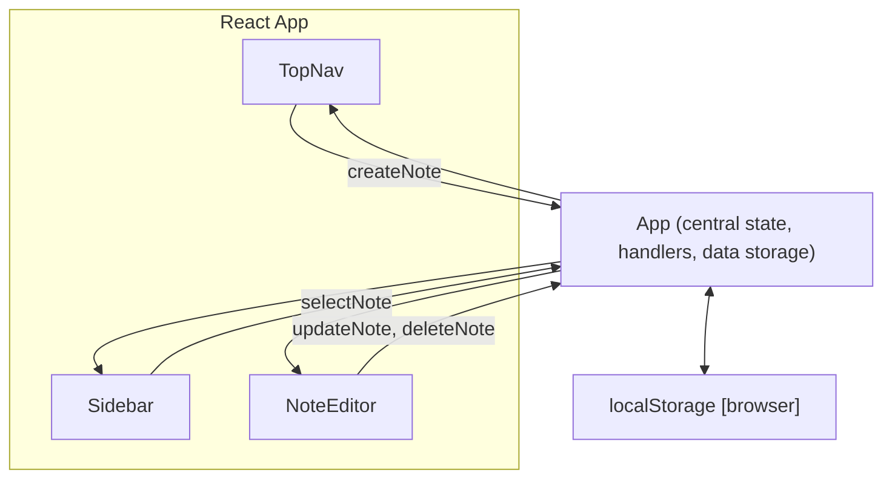

# Notes Frontend React App – API Documentation

This document details the internal API, data structures, storage, key functions, and public UI-facing interfaces for the `notes_frontend` React application. This application is a self-contained, client-side notes app. It operates entirely in the browser and persists data using `localStorage`—without any external server API.

## Table of Contents

1. [Application Overview](#application-overview)
2. [Main Data Structures](#main-data-structures)
3. [Local Storage Interface](#local-storage-interface)
4. [Main Components and Public Interface](#main-components-and-public-interface)
5. [Key Functions](#key-functions)
6. [Props, State, and State Management](#props-state-and-state-management)
7. [Component and App Diagram](#component-and-app-diagram)
8. [Usage Patterns](#usage-patterns)
9. [Extending the Application](#extending-the-application)
10. [File Index](#file-index)

---

## 1. Application Overview

The Notes Frontend is a lightweight, single-page React application that enables users to create, view, edit, delete, and search notes. Notes are stored persistently in the browser’s `localStorage`. All state and business logic reside within `App.js`, which defines the main app structure, top navigation, sidebar, and note editor as functional subcomponents.

- **Framework:** React (Functional components, Hooks API)
- **Persistence:** Browser `localStorage` (key: `"notes"`)
- **UI:** Modern, sidebar layout with a top navigation, using CSS variable theming

---

## 2. Main Data Structures

The only complex data structure is the "Note" object. All notes are stored as an array.

```js
// Note structure (TypeScript-style type for reference)
type Note = {
  id: string;          // Unique identifier, generated via Date.now()
  title: string;       // Title of the note
  body: string;        // Main note content (plain text)
  lastEdited: string;  // ISO date string of last modification time
}
```

### Notes Array

- Type: `Note[]`
- State Location: `const [notes, setNotes] = useState([]);`
- Storage Key: `"notes"` in `window.localStorage`

---

## 3. Local Storage Interface

All notes are persisted to and loaded from browser `localStorage` under the `"notes"` key.

- **Load:** Reads `"notes"` key on initial mount; parses JSON to array.
- **Save:** Whenever `notes` state changes, serializes to JSON and writes to `"notes"`.
- **No Versioning or Migration:** Direct replacement of old array with the new one.

### Storage Workflow

- On mount: 
  - `window.localStorage.getItem("notes")` —> parse and load to state.
- On any CRUD operation:
  - `window.localStorage.setItem("notes", JSON.stringify(notes))`

---

## 4. Main Components and Public Interface

All UI is managed within a single top-level component (`App`), which contains several functional subcomponents. There are no context providers or separate component files.

### App

- **Purpose:** Main application component; manages all state, logic, and UI.
- **Export:** `export default App;`
- **Public API:** Exposes several UI-facing, user-invokable functions for note operations:
  - `createNote`
  - `updateNote`
  - `deleteNote`
  - `selectNote`

### Inline Subcomponents

All subcomponents are functions within `App.js`, directly utilizing the current app state.

#### `TopNav`

- Renders the top navigation bar.
- Displays app branding and a "+ New" (create note) button.
- **Props:** None (accesses parent state/handlers)
- **Main Actions:** `onClick={createNote}`

#### `Sidebar`

- Shows the list of notes.
- Allows switching the active note and searching notes.
- **Interaction:** 
  - Each note is selectable (`onClick={() => selectNote(note.id)}`)
  - Includes a search field filtering notes by title/body.
- **Props:** None (accesses parent state/handlers)

#### `NoteEditor`

- Main editor for a note's title and body.
- Includes delete functionality.
- **Handlers:**
  - Title change: calls `updateNote(activeNote.id, ...)`
  - Body change: calls `updateNote(activeNote.id, ...)`
  - Delete: calls `deleteNote(activeNote.id)`

---

## 5. Key Functions

### `createNote()`

- **Creates a new note** with default fields and adds to the top of notes array.
- Changes activeNoteId to select the new note.

### `updateNote(id, fields)`

- **Edits a note** with matching `id`, updating properties provided in `fields` (partial note object).
- Always updates the `lastEdited` property to current datetime.

### `deleteNote(id)`

- **Removes a note** by its `id`. If this was the active note, selects a fallback note if any remain.

### `selectNote(id)`

- **Sets the currently edited/viewed note** by its `id`.

---

## 6. Props, State, and State Management

**Stateful Variables (within App):**

- `notes`: The array of all notes (see Data Structures)
- `activeNoteId`: The id of the note currently being shown/edited
- `searchTerm`: Search input, used to filter notes in the sidebar

**State Management:**

- Uses `useState` for stateful variables
- Uses `useEffect` for synchronizing state with `localStorage` (initial load and on update)

---

## 7. Component and App Diagram



---

## 8. Usage Patterns

### Creating a Note

- User clicks "+ New" — invokes `createNote()`
- A new note is inserted at the top of the note list, selected, and ready to edit.

### Editing a Note

- User edits title/body fields; fires `updateNote(id, { title, body })` on change.

### Deleting a Note

- User clicks Delete in NoteEditor — invokes `deleteNote(id)`. The next available note is selected.

### Searching Notes

- User types in sidebar search field; `notes` list is filtered live by title/body.

---

## 9. Extending the Application

To extend with new features (e.g., pinning/favoriting notes, tags, or dark mode):

- Add fields to the Note structure as needed.
- Extend the CRUD functions.
- Adjust storage migration if you intend to provide backward compatibility for future data model changes.
- Consider splitting App.js into multiple files as the app grows.

---

## 10. File Index

| File                    | Description                                 |
|-------------------------|---------------------------------------------|
| `src/App.js`            | Main application logic, UI, handlers        |
| `src/index.js`          | React entry point—renders `App` to DOM      |
| `src/App.css`           | CSS variables and styles for application    |
| `src/index.css`         | Global reset and font styling               |

---

### Last Update

This API documentation was autogenerated from code and reflects the current implementation and interface.

